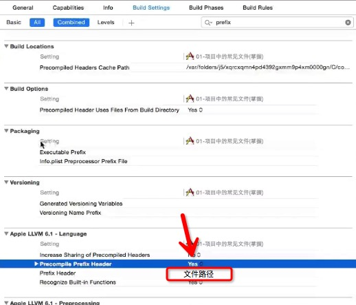

#**01-项目中常见文件**

###一. `Xcode5和Xcode6区别`

> 
1. xcode6没有Frameworks,而且xcode6会自动导入常见的开发框架   
2. xcode6比xcode5多了一个LaunchScreen.xib       3. 在iOS开发中,app的可见范围是由启动界面决定,如果没有设置启动界面,默认可视范围是3.5inch(320 * 480),如果设置了,就会自动自动识别当前模拟器的可视范围
4. xcode6比xcode5少了一个pch文件


###二. `info.plist文件`
```objc
1.Bundle name : app名称,项目通常使用英文,app名称显示中文

2.Bundle identifier : app标识符 上传AppStore和推送

3.Bundle versions string, short:  app版本号

4.Bundle version: 编译版本号

//程序中获取info.plist
NSDictionary *info = [NSBundle mainBundle].infoDictionary;
```
###三. `pch文件`

####**`pch作用:`**

```objc
//1. 存放一些公用的宏
#define ABC 10


//2. 存放一些公用的头文件
#import "ABC.h"


//3. 自定义NSLog
// ...           表示宏里面的可变参数
// __VA_ARGS__   表示函数里面的可变参数

// 表示当前调试阶段
#ifdef DEBUG
#define XMGLog(...)   NSLog(__VA_ARGS__)
#else
// 发布阶段
#define XMGLog(...)
#endif

 ```
 ---
 ####**`注意点:`**
 ```objc
 1. pch原理:就是把pch文件中的所有内容拷贝到所有文件的头部

 2. pch需要提前编译，设置方法如下图所示。

 3. 所有的OC文件都会定义__OBJC__这个宏,系统定义。
    防止OC代码导入到C语言文件中出错。
    #ifdef __OBJC__
        //OC相关代码
    #else
        //C相关代码
    #endif
 ```



