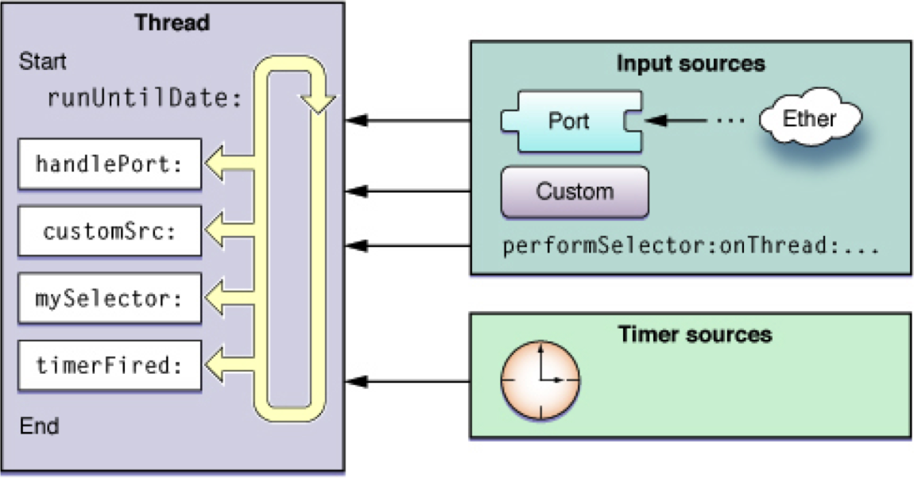
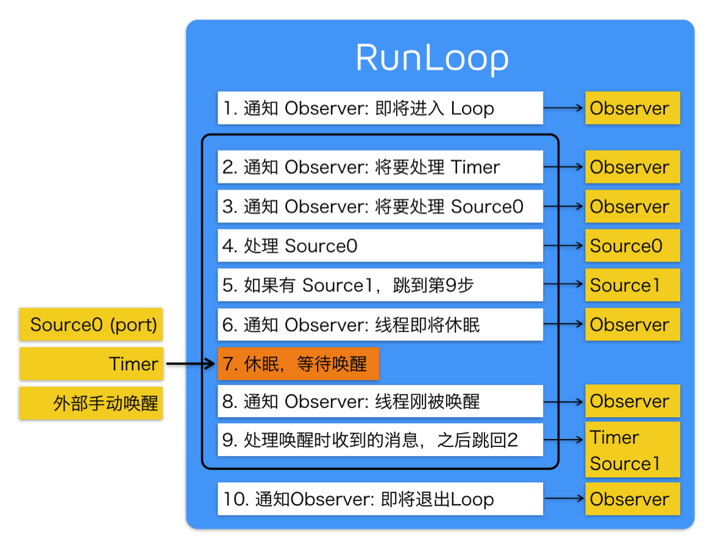

# 第九章 多线程（3）


####补充

    1-1 关于GCD中的创建和释放
   
    在iOS6.0之前，在GCD中每当使用带creat单词的函数创建对象之后，都应该对其进行一次release操作。
    在iOS6.0之后，GCD被纳入到了ARC的内存管理机制中，在使用GCD的时候我们就像对待普通OC对象一样对待GCD,
    因此不再需要我们调用release方法。
   
    1-2 GCD中设置队列的优先级
        01 使用create函数创建出来的队列不论是串行队列还是并发队列，，其执行任务线程的优先级都是默认优先级。
        02 可以通过set_target_queue来变更队列的优先级。第一个参数传通过creat创建出来的队列，
        后面一个参数传指定了优先级的全局并发队列。第一个参数如果传主队列或者全局并发队列的话，那么执行结果是未知的。

    1-3 暂停和恢复。
        GCD中的队列也是可以暂停和恢复的，直接把相应的队列作为参数就传递就可以。
        使用 dispatch_resume(queue1);和dispatch_suspend(queue1);

    1-4 GCD中可以不使用block而使用函数。

    1-5 在NSOperation中关于main方法的调用问题。
        先调用start方法，在start方法内部会调用main方法。可以通过代码来进行验证。

    参考资料：https://developer.apple.com/library/ios/documentation/Performance/Reference/GCD_libdispatch_Ref/index.html#//apple_ref/c/func/dispatch_queue_create

####1.Runloop基础知识
- 1.1 字面意思

		a 运行循环
		b 跑圈

- 1.2 基本作用（作用重大）

		a 保持程序的持续运行(ios程序为什么能一直活着不会死)
		b 处理app中的各种事件（比如触摸事件、定时器事件【NSTimer】、selector事件【选择器·performSelector···】）
		c 节省CPU资源，提高程序性能，有事情就做事情，没事情就休息

- 1.3 重要说明

        （1）如果没有Runloop,那么程序一启动就会退出，什么事情都做不了。
        （2）如果有了Runloop，那么相当于在内部有一个死循环，能够保证程序的持续运行
        （2）main函数中的Runloop
        		a 在UIApplication函数内部就启动了一个Runloop
        			该函数返回一个int类型的值
        		b 这个默认启动的Runloop是跟主线程相关联的

- 1.4 Runloop对象

        （1）在iOS开发中有两套api来访问Runloop
            a.foundation框架【NSRunloop】
            b.core foundation框架【CFRunloopRef】
        （2）NSRunLoop和CFRunLoopRef都代表着RunLoop对象,它们是等价的，可以互相转换
        （3）NSRunLoop是基于CFRunLoopRef的一层OC包装，所以要了解RunLoop内部结构，需要多研究CFRunLoopRef层面的API（Core Foundation层面）


- 1.5 Runloop参考资料

```objc
（1）苹果官方文档
https://developer.apple.com/library/mac/documentation/Cocoa/Conceptual/Multithreading/RunLoopManagement/RunLoopManagement.html

（2）CFRunLoopRef开源代码下载地址：
http://opensource.apple.com/source/CF/CF-1151.16/

```

- 1.6 Runloop与线程

		1.Runloop和线程的关系：一个Runloop对应着一条唯一的线程
    		问题：如何让子线程不死
    		回答：给这条子线程开启一个Runloop
		2.Runloop的创建：主线程Runloop已经创建好了，子线程的runloop需要手动创建
		3.Runloop的生命周期：在第一次获取时创建，在线程结束时销毁

- 1.7 获得Runloop对象

```objc
1.获得当前Runloop对象
    //01 NSRunloop
     NSRunLoop * runloop1 = [NSRunLoop currentRunLoop];
    //02 CFRunLoopRef
    CFRunLoopRef runloop2 =   CFRunLoopGetCurrent();

2.拿到当前应用程序的主Runloop（主线程对应的Runloop）
    //01 NSRunloop
     NSRunLoop * runloop1 = [NSRunLoop mainRunLoop];
    //02 CFRunLoopRef
     CFRunLoopRef runloop2 =   CFRunLoopGetMain();

3.注意点：开一个子线程创建runloop,不是通过alloc init方法创建，而是直接通过调用currentRunLoop方法来创建，它本身是一个懒加载的。
4.在子线程中，如果不主动获取Runloop的话，那么子线程内部是不会创建Runloop的。可以下载CFRunloopRef的源码，搜索_CFRunloopGet0,查看代码。
5.Runloop对象是利用字典来进行存储，而且key是对应的线程Value为该线程对应的Runloop。

```
- 1.8 Runloop相关类

（1）Runloop运行原理图



（2）五个相关的类

	a.CFRunloopRef
	b.CFRunloopModeRef【Runloop的运行模式】
	c.CFRunloopSourceRef【Runloop要处理的事件源】
	d.CFRunloopTimerRef【Timer事件】
	e.CFRunloopObserverRef【Runloop的观察者（监听者）】

（3）Runloop和相关类之间的关系图

 

（4）Runloop要想跑起来，它的内部必须要有一个mode,这个mode里面必须有source\observer\timer，至少要有其中的一个。

- CFRunloopModeRef

    	1.CFRunloopModeRef代表着Runloop的运行模式
    	2.一个Runloop中可以有多个mode,一个mode里面又可以有多个source\observer\timer等等
    	3.每次runloop启动的时候，只能指定一个mode,这个mode被称为该Runloop的当前mode
    	4.如果需要切换mode,只能先退出当前Runloop,再重新指定一个mode进入
    	5.这样做主要是为了分割不同组的定时器等，让他们相互之间不受影响
    	6.系统默认注册了5个mode
    	    a.kCFRunLoopDefaultMode：App的默认Mode，通常主线程是在这个Mode下运行
            b.UITrackingRunLoopMode：界面跟踪 Mode，用于 ScrollView 追踪触摸滑动，保证界面滑动时不受其他 Mode 影响
            c.UIInitializationRunLoopMode: 在刚启动 App 时第进入的第一个 Mode，启动完成后就不再使用
            d.GSEventReceiveRunLoopMode: 接受系统事件的内部 Mode，通常用不到
            e.kCFRunLoopCommonModes: 这是一个占位用的Mode，不是一种真正的Mode


- CFRunloopTimerRef

（1）NSTimer相关代码
```objc
/*
	说明：
	（1）runloop一启动就会选中一种模式，当选中了一种模式之后其它的模式就都不鸟。
    一个mode里面可以添加多个NSTimer,也就是说以后当创建NSTimer的时候，可以指定它是在什么模式下运行的。
	（2）它是基于时间的触发器，说直白点那就是时间到了我就触发一个事件，触发一个操作。基本上说的就是NSTimer
	（3）相关代码
*/
- (void)timer2
{
    //NSTimer 调用了scheduledTimer方法，那么会自动添加到当前的runloop里面去，而且runloop的运行模式kCFRunLoopDefaultMode

    NSTimer *timer = [NSTimer scheduledTimerWithTimeInterval:2.0 target:self selector:@selector(run) userInfo:nil repeats:YES];

    //更改模式
    [[NSRunLoop currentRunLoop] addTimer:timer forMode:NSRunLoopCommonModes];

}

- (void)timer1
{
    //    [NSTimer scheduledTimerWithTimeInterval:2.0 target:self selector:@selector(run) userInfo:nil repeats:YES];

    NSTimer *timer = [NSTimer timerWithTimeInterval:2.0 target:self selector:@selector(run) userInfo:nil repeats:YES];

    //定时器添加到UITrackingRunLoopMode模式，一旦runloop切换模式，那么定时器就不工作
    //    [[NSRunLoop currentRunLoop] addTimer:timer forMode:UITrackingRunLoopMode];

    //定时器添加到NSDefaultRunLoopMode模式，一旦runloop切换模式，那么定时器就不工作
    //    [[NSRunLoop currentRunLoop] addTimer:timer forMode:NSDefaultRunLoopMode];

    //占位模式：common modes标记
    //被标记为common modes的模式 kCFRunLoopDefaultMode  UITrackingRunLoopMode
    [[NSRunLoop currentRunLoop] addTimer:timer forMode:NSRunLoopCommonModes];

    //    NSLog(@"%@",[NSRunLoop currentRunLoop]);
}

- (void)run
{
    NSLog(@"---run---%@",[NSRunLoop currentRunLoop].currentMode);
}

- (IBAction)btnClick {

    NSLog(@"---btnClick---");
}

```

（2）GCD中的定时器
```objc
//0.创建一个队列
    dispatch_queue_t queue = dispatch_get_global_queue(0, 0);

    //1.创建一个GCD的定时器
    /*
     第一个参数：说明这是一个定时器
     第四个参数：GCD的回调任务添加到那个队列中执行，如果是主队列则在主线程执行
     */
    dispatch_source_t timer = dispatch_source_create(DISPATCH_SOURCE_TYPE_TIMER, 0, 0, queue);

    //2.设置定时器的开始时间，间隔时间以及精准度

    //设置开始时间，三秒钟之后调用
    dispatch_time_t start = dispatch_time(DISPATCH_TIME_NOW,3.0 *NSEC_PER_SEC);
    //设置定时器工作的间隔时间
    uint64_t intevel = 1.0 * NSEC_PER_SEC;

    /*
     第一个参数：要给哪个定时器设置
     第二个参数：定时器的开始时间DISPATCH_TIME_NOW表示从当前开始
     第三个参数：定时器调用方法的间隔时间
     第四个参数：定时器的精准度，如果传0则表示采用最精准的方式计算，如果传大于0的数值，则表示该定时切换i可以接收该值范围内的误差，通常传0
     该参数的意义：可以适当的提高程序的性能
     注意点：GCD定时器中的时间以纳秒为单位（面试）
     */

    dispatch_source_set_timer(timer, start, intevel, 0 * NSEC_PER_SEC);

    //3.设置定时器开启后回调的方法
    /*
     第一个参数：要给哪个定时器设置
     第二个参数：回调block
     */
    dispatch_source_set_event_handler(timer, ^{
        NSLog(@"------%@",[NSThread currentThread]);
    });

    //4.执行定时器
    dispatch_resume(timer);

    //注意：dispatch_source_t本质上是OC类，在这里是个局部变量，需要强引用
    self.timer = timer;

```

- CFRunloopSourceRef

    	1.是事件源也就是输入源，有两种分类模式；
    	  一种是按照苹果官方文档进行划分的
    	  另一种是基于函数的调用栈来进行划分的（source0和source1）。
        2.具体的分类情况
            （1）以前的分法
                Port-Based Sources
                Custom Input Sources
                Cocoa Perform Selector Sources

            （2）现在的分法
                Source0：非基于Port的
                Source1：基于Port的
        3.可以通过打断点的方式查看一个方法的函数调用栈

- CFRunLoopObserverRef

（1）CFRunLoopObserverRef是观察者，能够监听RunLoop的状态改变

（2）如何监听
```objc
 //创建一个runloop监听者
    CFRunLoopObserverRef observer = CFRunLoopObserverCreateWithHandler(CFAllocatorGetDefault(),kCFRunLoopAllActivities, YES, 0, ^(CFRunLoopObserverRef observer, CFRunLoopActivity activity) {

        NSLog(@"监听runloop状态改变---%zd",activity);
    });

    //为runloop添加一个监听者
    CFRunLoopAddObserver(CFRunLoopGetCurrent(), observer, kCFRunLoopDefaultMode);

    CFRelease(observer);
```
（3）监听的状态
```objc
typedef CF_OPTIONS(CFOptionFlags, CFRunLoopActivity) {
    kCFRunLoopEntry = (1UL << 0),   //即将进入Runloop
    kCFRunLoopBeforeTimers = (1UL << 1),    //即将处理NSTimer
    kCFRunLoopBeforeSources = (1UL << 2),   //即将处理Sources
    kCFRunLoopBeforeWaiting = (1UL << 5),   //即将进入休眠
    kCFRunLoopAfterWaiting = (1UL << 6),    //刚从休眠中唤醒
    kCFRunLoopExit = (1UL << 7),            //即将退出runloop
    kCFRunLoopAllActivities = 0x0FFFFFFFU   //所有状态改变
};
```

- 1.9 Runloop运行逻辑
-

--------------------


####2.Runloop应用

    NSTimer
    ImageView显示
    PerformSelector
    常驻线程
    自动释放池


